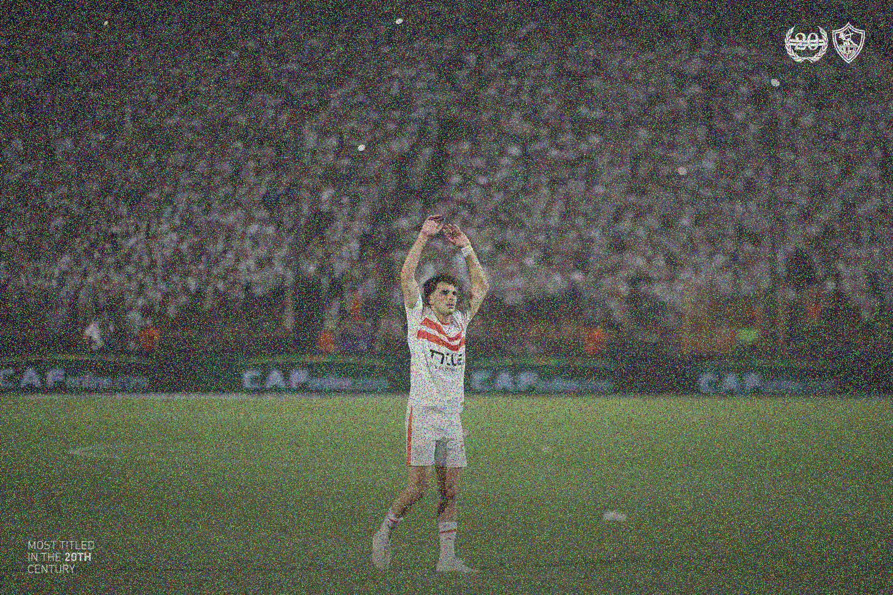

# About

This project implements an algorithm that encrypts a grayscale image using the DES encryption algorithm and embeds the encrypted data into an RGB image. The encryption ensures the grayscale image's content is securely hidden, while the resulting RGB image appears as a noisy version of the original. The noise is evenly distributed across the RGB image to prevent concentration in specific areas.

The project uses:

- Python's **Pillow** library for image manipulation

- `pycryptodome` for **DES** encryption

- **numpy** for efficient data handling


# How to Run It Locally

1. Clone the Repository:
    ``` bash
        git clone git@github.com:mohamedhassan218/DES.git
        cd DES
    ```
2. Create your local env:
   ``` bash 
        python -m venv .venv
   ```
3. Activate your env:
   ``` bash 
        .venv\Scripts\activate
   ```
4. Install the Dependencies:
    ``` bash 
        pip install -r requirements.txt
    ```
5. Run the Script:
   ``` bash 
   py algo.py
   ```

# Output Example
<!-- <div align="center">
  <p align="center">  
    
  </p>
</div>

<div align="center">
<p align="center">Chat with website</p>
  <p align="center">  
    
  </p>
</div> -->

<!-- <div align="center">
  <p align="center" style="display: flex; justify-content: center; gap: 10px;">
    
    <p align="center">+</p>
    
    <p align="center">=</p>
    
  </p>
</div> -->

<!-- Output Example -->
<div align="center">
  <div style="display: flex; align-items: center; justify-content: center; gap: 10px;">
    
    <span style="font-size: 24px; font-weight: bold;">+</span>
    
    <span style="font-size: 24px; font-weight: bold;">=</span>
    
  </div>
</div>
